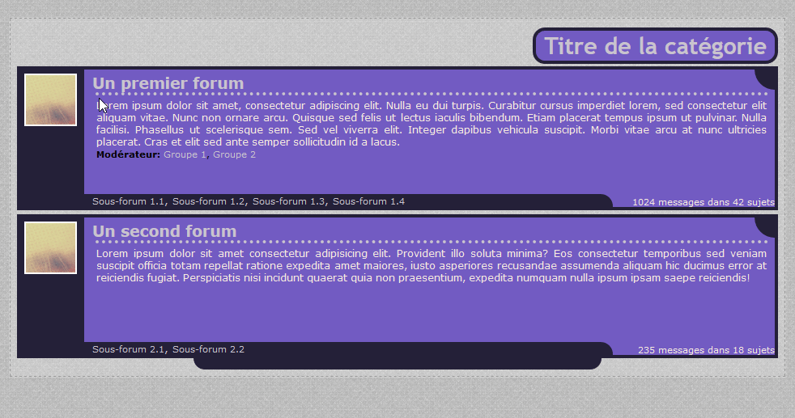

# Personnalisation des catégories de Forumactif - Nom de code : Puki

## Introduction

### A propos de ce code
Ces codes sont destinés à la personnalisation de l'affichage des catégories d'un forum créé sur la plateforme d'hébergement de forums [Forumactif](https://www.forumactif.com/). 

La présente structure est le résultat d'une commande de catégories faite par Puki sur le forum SOS RPG (aujourd'hui fermé) en 2012. Dans la mesure où le forum auquel était destiné la commande est complètement mort, je partage le code remis au goût du jour.

### Spécifications
* Utilise les classes natives de Forumactif : la taille du texte sera influencée par vos réglages dans le panneau admin (vous pouvez naturellement modifier ça via le CSS) ;
* Les infos sur le dernier message posté apparaissent au survol sur le coin supérieur droit du cadre d'un forum ;
* L'affichage de l'avatar à côté du lien du dernier message posté est pris en charge ;
* Les descriptions de forum (et les images qui y sont ajoutées) sont limitées en hauteur, un défilement apparait en cas de dépassement ;
* L'affichage en mode non compressé est plus ou moins géré ;



### Règles d'utilisation

Ce n'est pas parce que je propose mes codes en libre service que vous pouvez faire n'importe quoi avec ; n'oublions pas qu'ils restent le fruit de mon travail !  Merci donc de respecter les quelques règles qui suivent.
* Vous pouvez éditer ce code selon vos besoins ;
* Vous ne **pouvez pas** redistribuer ce code sur un autre forum, quel qu'il soit, même si vous l'avez modifié ;
* Vous devez **impérativement** laisser mes crédits, même après modification (vous pourrez évidemment ajouter "personnalisé par (pseudo)") ;
* L'usage de ce code est autorisé pour un usage strictement personnel et non commercial ;
* En aucun cas vous ne pouvez utiliser ce code sur un forum faisant la promotion de tout contenu de nature discriminatoire ou illégale. Cette interdiction s'applique également aux forums RPG dits "Hentai/Yaoi/Yuri" (RPG érotique) qui ne mettent pas en place les mesures minimales de protection contre les mineurs (contenu sensible caché aux visiteurs, avertissement clair et visible à l'inscription et sur l'accueil, et pas de personnages mineurs)
* Merci d'ajouter un lien retour vers le forum où vous avez trouvé ce LS sur votre forum (dans une section crédits par exemple) si vous utilisez ce code.

## Edition du template *index_box*
Rendez-vous dans votre panneau d'administration, onglet **_Affichage_** puis dans le menu **_Templates » Général_** et ouvrez le template *index_box*.

Cherchez les commentaires `<!-- BEGIN catrow -->`et `<!-- END catrow -->`. Sélectionnez ces deux lignes et tout ce qu'il y a entre les deux, et remplacez le tout par le code du fichier [catpuki_template-edit.html](catpuki_template-edit.html)

## La feuille de styles
Rendez-vous dans votre panneau d'administration, onglet **_Affichage_**, puis dans le menu **_Images et couleurs » Couleurs_** et enfin cliquez sur l'onglet **_Feuille de styles CSS_**. 

Dans le champ de texte, à la suite du code CSS existant s'il y en a, collez le code du fichier [catpuki_styles.css](catpuki_styles.css).

## Personnalisation

J'ai essayé de commenter le code au maximum pour le rendre personnalisable mais il reste assez touffu. Voici quelques coups de pouce pour personnaliser un peu l'apparence du tout. Je mettrai à jour cette section en fonction des questions et demandes de personnalisation futures (dans une certaine limite XD).

### Génération du CSS

Pour vous simplifier (peut-être) les choses, vous pouvez utiliser la [version SCSS](misc/catpuki_styles.scss) de la feuille de styles. 

En début de fichier, vous constaterez une liste de variables, qui seront utilisées ensuite dans le reste du fichier SCSS à la place de leur valeur. Ainsi, si on souhaite modifier toutes les couleurs (en particulier) il suffira de modifier ces variables, puis de générer le fichier CSS final en utilisant un [compilateur SASS en ligne](https://www.startpage.com/do/dsearch?query=compilateur+sass+online&cat=web&pl=ext-ff&language=francais) pour générer le CSS final à utiliser.

**Important :** Vous ne pouvez pas utiliser le fichier SCSS tel quel sur votre forum ! Il faut le compiler pour obtenir un code CSS exploitable.

### Ajuster les dimensions
Normalement, la zone contenant l'icone du forum s'adapte automatiquement à la taille de ladite icone. Cependant, il faudra ajuster manuellement les distances entre cette zone et la description, ainsi que la hauteur du bloc du forum. Pour cela, il y a une zone réservée à ces réglages vers la fin du code CSS, cherchez le commentaire suivant :

```css
/* 
===============================================
RÉGLAGES IMPORTANTS - A ajuster selon vos besoins
===============================================
*/
```
Aidez vous des commentaires CSS pour déterminer les dimensions.

### Plus de place pour les statistiques
Le texte des statistiques d'un forum (en bas à droite du cadre) dispose d'une place limitée. Si vous estimez que vous avez besoin de plus de place (par exemple si vous avez plus de 9999 messages et 99 topics dans certains forums), il vous faudra modifier la classe `.lmcat__forum-sousforums`. Dans votre CSS, cherchez donc la ligne suivante : 

```css
.lmcat__forum-sousforums {
```
Et à l'intérieur de cette classe, retrouvez cette partie : 

```css
/* largeur de la barre */
width: calc(100% - 200px);
```

Modifiez juste la valeur `200px` par une valeur plus grande.


### Personnaliser les liens

Dans la section "Aspect des liens" du CSS, vous pouvez rajouter quelques lignes si vous souhaitez plus de personnalisation que ce qui est disponible de base. 

```css
/* Personnaliser le lien de titre du forum */
.lmcat__forum-titre--lien { 
    color: #FFFFFF; 
}
```

```css
/* Personnaliser le lien du dernier message posté */
.lmcat__forum-dernierpost--lien { 
    color: #FFFFFF; 
}
```

### Affichage du dernier message posté au survol du titre du forum

Si vous trouvez que la petite zone dans le coin supérieur droit du cadre des forums est trop difficile à cibler, vous pouvez modifier le code pour que l'encadré s'affiche également au survol du titre du forum.

Cherchez cette ligne :

```css
.lmcat__forum-dernierpost:hover, .lmcat__forum-dernierpost--survol {
```
Et remplacez-la par ceci :

```css
.lmcat__forum-titre:hover ~ .lmcat__forum-dernierpost,
.lmcat__forum-dernierpost:hover, .lmcat__forum-dernierpost--survol {
```

Et de même cherchez cette ligne :

```css
.lmcat__forum-dernierpost:hover > div {
```
Et remplacez-la par ceci :
```css
.lmcat__forum-titre:hover ~ .lmcat__forum-dernierpost > div,
.lmcat__forum-dernierpost:hover > div {
```
